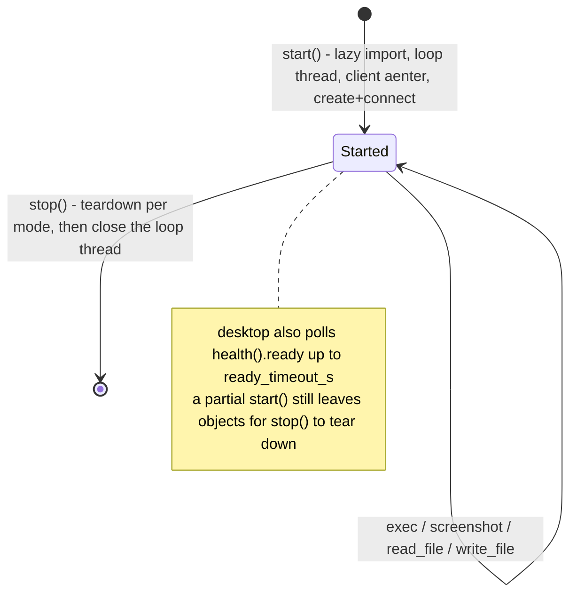

# Runtimes

A runtime is WHERE a step's shell commands run and WHERE its screenshots come from. It is not a
model, and it is not the executor. `executors/tools.py`'s `shell.run` and `runtime.screenshot`
handlers call straight through the protocol.

## `can_exec` — never gate on `runtime is not None`

**A `Runtime` is always a real object, even when it does nothing.** `NoneRuntime` is not `None`; its
`exec()` raises `RuntimeUnavailable`. A null check on an object that is never null made `shell.run`
return an error on EVERY call under `runtime: {type: none}` — the documented default and what
`file-text-none.yaml` ships — and equally under `solari` in `mode: desktop`/`browser`. `shell.run` is
granted to `implement` and `verify` in all three built-in pipelines, so the coder could never run a
build and the tester could never run the tests, in three of the four shipped profiles.

The capability flag is the check:

```python
if ctx.runtime is not None and getattr(ctx.runtime, "can_exec", True):
    out = ctx.runtime.exec(argv, cwd=..., timeout=...)
else:
    ...run it locally...
```

`BaseRuntime.can_exec` defaults True; `NoneRuntime` sets it False; `SolariRuntime` makes it a
property that is True only in `mode: sandbox`. It is read duck-typed so `tools.py` knows nothing
about runtime classes. A runtime that cannot execute means "the caller does the work", never "the
step fails".

## `BaseRuntime`

Mixin providing `__enter__`/`__exit__` and an idempotent `start()`/`stop()` around `_do_start()` /
`_do_stop()`. `_started` is a plain class attribute, not a dataclass field, because concrete runtimes
parse an `AdapterConfig` in their own `__init__` and never call `super().__init__()`. A runtime with
real lifecycle subtleties overrides `start()`/`stop()` directly and owns its own idempotency.

## `NoneRuntime` — the default

No commands, no screenshots, no session. `screenshot()` and `preview_url()` return `None` rather than
raising — that is the contract that lets a profile configure `screenshot_on:` and later swap in
Solari without the pipeline changing. `exec()`, `read_file()`, `write_file()` raise
`RuntimeUnavailable`.

## `LocalShellRuntime`

Real subprocesses on this machine, jailed to `root` (constructor kwarg wins over `cfg.opt("root")`,
resolved once at construction). Same rules as `ProcessExecutor`: `shell=False`, argv lists only, an
explicit env allowlist. It imports `jail`/`ToolError` from `executors/tools.py` so there is one
containment definition. `screenshot()` returns `None`; `preview_url(port)` returns a localhost URL.

## `SolariRuntime` — lifecycle rules encoded in code, not comments

Cloud sandboxes, browsers and desktops behind one `SOLARI_API_KEY`. Three modes, three SDKs
(`solari_sandbox`, `solari_desktop`, `solari_browser`), imported LAZILY inside `start()` so the
module imports without the `[solari]` extra.

The SDKs are async and the protocol is sync, so every call is dispatched onto ONE asyncio event loop
pinned to ONE daemon thread (`_LoopThread`) for the runtime's whole life. **Do not call
`asyncio.run()` per method** — that creates and destroys a loop per call and invalidates the SDK's
session objects.



Rules that are load-bearing:

- **sandbox teardown is `kill()`, never `close()`** — `close()` only drops the local control channel
  and the VM keeps running (and billing) until its idle timeout;
- **desktop teardown is `close()` AND `client.destroy(session_id)`**;
- `stop()` is idempotent, runs even after a PARTIAL `start()`, wraps each teardown step individually
  so one failure never skips the next, and logs rather than raises — a leaked cloud VM keeps billing;
- `timeout_ms` is a rolling IDLE window that resets on every call, **not** a deadline; bounding a
  step's wall-clock time is `engine/budget.py`'s job;
- sandbox `run_code` results are a list of items with `.type`/`.text` — there is no top-level
  `.stdout` (`_stdout_text` concatenates the `stdout`-typed items);
- sandbox commands are not shell-interpreted: argv goes through `args`, never a formatted string;
- the Python `commands.run` / `previewUrl` surface is unconfirmed (it appears only in the TS
  examples), so both are feature-detected with `getattr`/`hasattr`, with a `run_code` fallback;
- that fallback embeds its payload as a JSON string LITERAL (`json.dumps` twice) spliced into a fixed
  Python snippet — model-supplied strings are never formatted into shell or Python source;
- `api_key_ref` is kept UNEXPANDED until `start()`, so `ticketbot validate` works without the key;
- `screenshot()` returns `None` in sandbox mode; `preview_url()` returns `None` outside it.

`describe()`: `Solari desktop 1280x720`, `Solari sandbox (base)`, `Solari browser`.
