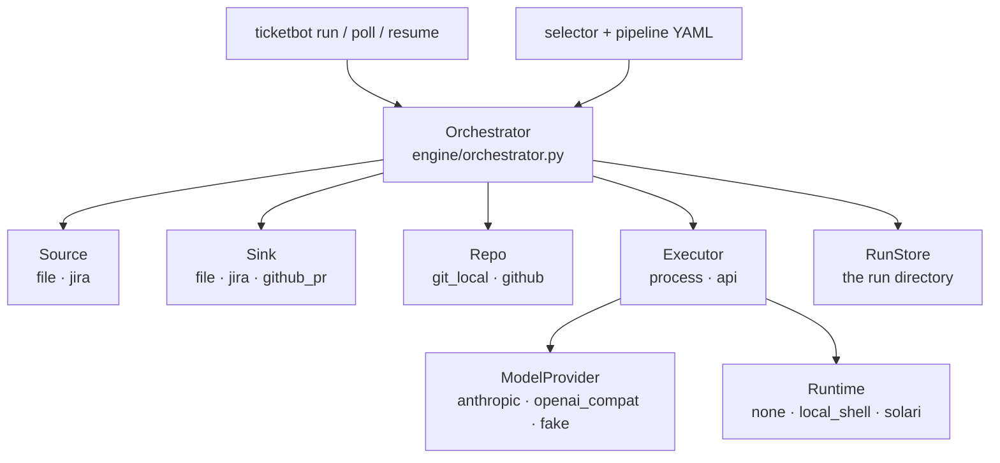

# Architecture: the swap-point runtime

`ticketbot` is an orchestrator surrounded by six adapter families. The orchestrator owns the run
loop, the run directory and the safety rails; every external system sits behind a protocol and is
chosen by one `type:` string in a profile.

`ModelProvider` (raw completion) and `Executor` (how a step's work actually gets done) are
deliberately separate — that separation is what makes "any AI" work. A `process` executor spawns a
coding CLI that brings its own model; an `api` executor drives a `ModelProvider` through our own
path-jailed tool loop.

## Package layout

| Path | What lives there |
|---|---|
| `ticketbot/config/` | profile schema, YAML loader (`extends:`, `builtin:`, `${ENV}`), secret redaction |
| `ticketbot/core/` | `WorkItem`, `Run`/`RunStore`, banner, templating, the safe `when:` parser, registry |
| `ticketbot/engine/` | pipeline + selector + gates + locks + budget + the orchestrator loop + the `QUESTION:`/`DEFER:` protocol |
| `ticketbot/executors/` | `process`, `api`, and the path-jailed tool implementations |
| `ticketbot/models/` | `ModelProvider` implementations — the ONLY place `anthropic` is imported |
| `ticketbot/adapters/` | `sources/`, `sinks/`, `runtimes/`, `repos/` — one directory per swap point |
| `ticketbot/builtin/` | shipped pipelines, role prompts, ticket-comment templates |
| `ticketbot/cli.py` | argparse entry point; every subcommand returns an int exit code |
| `profiles/` | example profiles (`_base.yaml` plus four verticals) |
| `tests/` | pytest suite, `fakes.py`, `fixtures/` |

## Dependency direction

`config` and `core` know nothing about adapters. `adapters`, `models` and `executors` depend on
`config`/`core`. `engine` depends on everything, but reaches concrete adapter modules only through
the registries — see [registry.md](registry.md). Nothing depends on `engine` except `cli.py`.

One-way exceptions worth knowing:

- `adapters/runtimes/local_shell.py` imports `jail`/`ToolError` from `executors/tools.py` so the
  runtime and the tool layer share one containment definition.
- `adapters/repos/github.py` imports `github_rest_headers()` and `write_body_tempfile()` from
  `adapters/sinks/github_pr.py`, so the two GitHub clients cannot diverge on auth headers or on the
  "never an inline `--body`" rule.
- `adapters/sinks/jira.py` builds its HTTP client through `adapters/sources/jira.py: JiraConnection`
  — one place constructs the Jira client.

## Where to look next

- Protocol shapes and optional methods: [adapter-protocols.md](adapter-protocols.md)
- The registry contract and how to add an adapter: [registry.md](registry.md)
- Profiles and pipelines: [../config/summary.md](../config/summary.md), [../pipelines/summary.md](../pipelines/summary.md)
- The run loop: [../engine/summary.md](../engine/summary.md)
