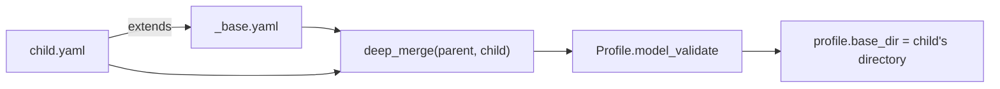

# `extends:`, `builtin:` and reference resolution

## `extends:` DEEP-merges

`load_profile_dict()` walks the `extends:` chain, loads each file with `yaml.safe_load`, and merges
child over parent with `deep_merge()`:

- nested dicts merge recursively;
- scalars **and lists** in the child REPLACE the parent's value (lists are never concatenated);
- the result is a deep copy — mutating it cannot reach back into either input;
- a cycle raises `ConfigError` naming the files;
- the `extends` key itself is dropped from the result;
- `base_dir` is the directory of the OUTERMOST (child) profile, not of the parent that declared a ref.

## The leak this causes — the trap, twice

A profile does NOT opt out of an inherited block by omitting it. Two real failures:

1. **The `peer` model slot.** `profiles/github-codex.yaml` exists to use no Anthropic model at all,
   but `builtin/pipelines/standard.yaml`'s `review` step asks for `model: peer`. Omitting `peer`
   silently inherited `_base.yaml`'s Anthropic provider, so `review` quietly called the one vendor
   that profile exists to avoid. The fix is an explicit override, with a comment saying why.
2. **`repo.path`.** `_base.yaml` carried `path: "."`. Both `repo: {type: github}` profiles declare a
   `clone:` and no `path`, but inherited `"."` anyway. `GithubRepo` only installs its per-repo clone
   cache `if cfg.opt("path") is None`, so with the inherited value `self.path` became the PROFILE's
   directory — `git fetch origin --prune` and `git worktree add` ran against the ticketbot checkout
   itself instead of the cloned repo.

Rules that fall out of it:

- **A parent holds only what EVERY child wants.** `_base.yaml` now says `repo: {type: git_local}`
  with no `path`; `GitLocalRepo` defaults `path` to `"."` on its own, so nothing regressed.
- **A child that means to replace an inherited block must say so explicitly**, with a comment
  explaining what would leak otherwise.
- **Assert such properties on the LOADED profile**, never by scanning the file's own text — the text
  cannot see what `extends:` brought in. `tests/test_profiles.py` does exactly this, e.g.
  `test_no_github_repo_profile_inherits_a_local_repo_path`.

## `builtin:` and other refs

`resolve_ref(ref, base_dir)`:

- `builtin:pipelines/standard.yaml` resolves against `<installed package>/builtin/`, wherever the
  profile file itself lives. A `..` segment, or a path escaping the builtin root, raises `ConfigError`.
- anything else resolves relative to `base_dir` (the profile's own directory); absolute paths pass
  through unchanged.
- a resolved path that does not exist raises `ConfigError` naming both the ref and the resolution.

Used for `extends:`, `pipeline_selector.*.use`, and a step's `prompt:` override. The default role
prompt ref is `builtin:prompts/roles/<role>.md`.
