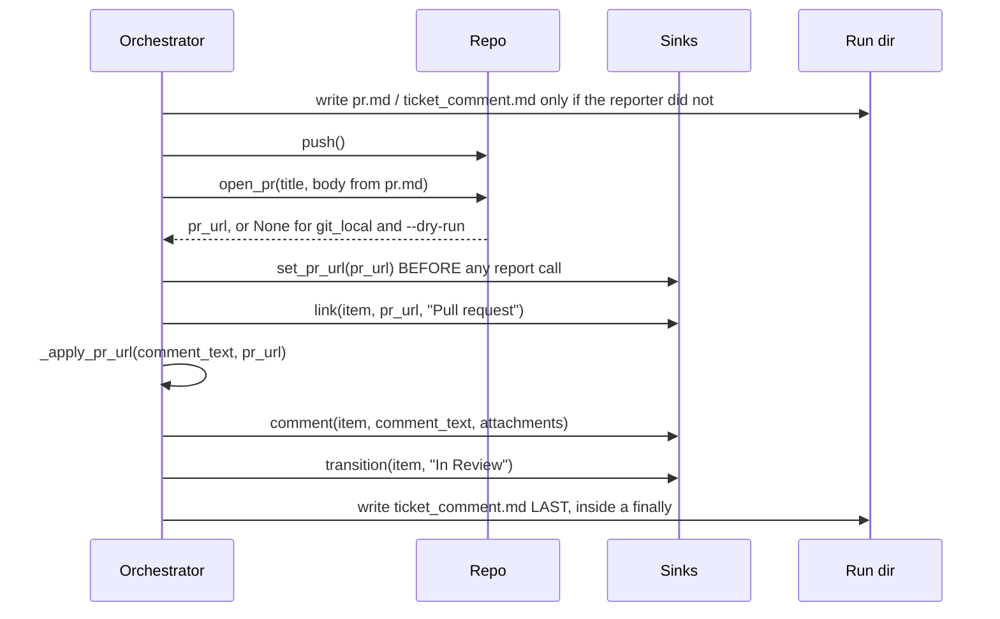

# Reporting: the PR URL hand-off and the ticket comment

The trickiest seam in the system: the reporter writes the ticket comment BEFORE the pull request
exists, and one sink cannot report anything until it knows which PR to post onto.

## Order of operations in `_after_reporter`

## Three rules encoded there

1. **`set_pr_url` precedes the first report call.** `GithubPrSink` posts ONTO the PR and logs-and-
   drops every `comment()`/`link()` it receives until it holds a URL. Telling it after the first
   `link()` silently loses the whole report. `MultiSink.set_pr_url` fans it out by `getattr` probe;
   a sink without the method is skipped, and a raise there is logged, never propagated — it is a
   hand-off before the report, not the report itself. This shape is the template for anything else
   that must reach a sink after construction: an optional method, `getattr`-probed, fanned out by
   `MultiSink`, never added to the `Sink` protocol.
2. **`_apply_pr_url` fills the line the reporter could not.** `prompts/roles/reporter.md` asks for a
   line written exactly as `PR: {pr_url}`, which renders blank at reporter time. The helper handles
   the literal `{pr_url}` token, a blank `PR:` line (`_EMPTY_PR_LINE_RE`), a comment that already
   names the URL, and otherwise appends the link — so the posted comment always carries it.
3. **The canonical `ticket_comment.md` is written AFTER the sink call**, unconditionally, inside a
   `finally` so a failing sink still leaves the record. `FileSink.comment()` APPENDS to that same
   path with a `---` separator when the file already exists, so writing before the sink call left
   the offline default profile's headline artifact holding the comment twice. The artifact must be
   exactly what was posted, once.

`pr.md` and `ticket_comment.md` are only written from the step's returned text when the reporter did
not produce them itself, so a real reporter's files are never clobbered.

Screenshots recorded in `run.extra["screenshots"]` become `Attachment` objects passed to
`sink.comment(...)`. `FileSink` copies them into `attachments/`; `JiraSink` uploads them before
posting; `GithubPrSink` cannot upload at all and references their local paths in the comment body.

Finally, `gates.on_pr_ready(run)` decides whether the run stops for a human (`human_review` -> the
run goes BLOCKED with a `question.md` saying the PR awaits review) or finishes on its own (`auto`).
Neither merges.
