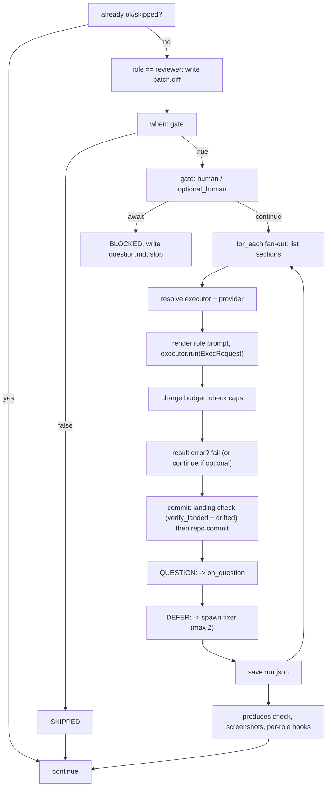

# The engine: `Orchestrator` and the run loop

`engine/orchestrator.py` is the only place a `Profile` is wired to live adapter objects. It reaches
concrete adapters only through the registries, with `inspect.signature` kwarg filtering
([../architecture/registry.md](../architecture/registry.md)). The single deliberate direct import is
`FileSource`, so `--input-text`/`--input` can override the configured source.

## Entry points

```python
run_once(external_id=None, input_text=None, input_path=None, force_lock=False) -> Run
resume(run_id, force_lock=False) -> Run
poll(once=False, max_items=None) -> list[Run]
```

Each opens a source and closes it in a `finally` (`_close_source` also clears the cache, so a closed
client is never handed to a second run). `poll()` skips an item whose lock is already held rather
than waiting, and calls `mark_processed(item)` once the item's run is terminal — without that, a
`file` source re-yields every inbox file on every sweep, forever.

`_run_pipeline` builds the sink and closes THAT object in a `finally` — the real one, not the
`--dry-run` wrapper, which deliberately never touches its inner sink.

## Starting a fresh run

`_begin_fresh_run` writes `workitem.json` and `config.resolved.yaml`, selects the pipeline, loads it,
computes the branch name, renders and prints the banner, then `source.claim(item)`. A lost claim
finalizes the run as FAILED with `extra["error"] = "claim lost"` and returns without checking out
anything. Only then does `repo.checkout(branch)` run and `extra["branch"]/["workspace"]` get
recorded.

`--dry-run` wraps the sink in `DryRunSink` and the repo in `_DryRunRepo`: local operations (checkout,
commit, diff, the landing check, cleanup) still really happen, but `push()` and `open_pr()` become log
lines in `dryrun.log`, so nothing outward-facing occurs.

## One step



Details that matter:

- The resume skip is `run.is_complete(step.id)` (status OK or SKIPPED).
- `_before_review` runs BEFORE the `when:` gate for a `reviewer` step: it writes `patch.diff` and
  fills `run.extra["diff_files"]` / `["diff_touches_security"]`, which the `security` step's `when:`
  then reads.
- The human gate is `gate: human` always, `gate: optional_human` only when `--pause-at <step-id>`
  names this step (or `Orchestrator(interactive=True)`, which has no CLI flag).
- Timeouts are `budget.step_timeout(step.timeout_s or defaults.timeout_s or 1800)`, clamped to the
  remaining wall clock and floored at 30s.
- `max_cost_usd` per step is what remains of the run's cost budget.
- `run.json` is saved after EVERY fan-out iteration, not just at the end of the step.
- A per-iteration `result.error` stops the remaining sections immediately, so an early section's
  failure is never masked by a later one that happens to succeed.
- After the loop: warn about missing `produces`; capture a screenshot when
  `runtime.screenshot_on` names this step; then the per-role hooks.

## Per-role hooks

| Hook | Does |
|---|---|
| `_after_ingest` | parse the JSON envelope, fill `item.acceptance`/`item.ambiguity`, rewrite `workitem.json` |
| `_after_planner` | count `sections/section-*.md` into `run.extra["section_count"]`, scrape `Security: yes|no` from `plan.md` into `["plan_security"]` |
| `_before_review` | write `patch.diff`, set the `diff.*` context facts |
| `_after_reporter` | push, open the PR, hand the URL to the sinks, post the comment — see [reporting.md](reporting.md) |

## Statuses

`RunStatus`: `received`, `clarifying`, `planning`, `implementing`, `verifying`, `pr_open`, `blocked`,
`done`, `failed`. Step ids map to a status via `_STATUS_BY_STEP_ID` (`clarify`, `plan`, `implement`,
`verify`, `publish`); a pipeline finishing without stopping sets `DONE`.
`StepStatus`: `pending`, `ok`, `skipped`, `blocked`, `failed`.

## Escalation

`on_question: pause_and_relay` runs `gates.on_unclear` — which increments `clarify_rounds` and fails
once the cap is passed — writes `question.md`, and on a `block` decision comments, unassigns and
transitions through the sink before stopping. `fail` stops immediately; `ignore` records the question
and continues. `on_defer: spawn_fixer` runs the `fixer` role once per `DEFER:` line, capped at
`MAX_DEFERS_SPAWNED_PER_STEP = 2`, reusing the parent step's tools and executor, and committing only
when the landing check is clean (a bad landing there is logged, never fatal — the fixer is advisory).

Related: [run-store.md](run-store.md), [gates-locks-budget.md](gates-locks-budget.md),
[reporting.md](reporting.md).
