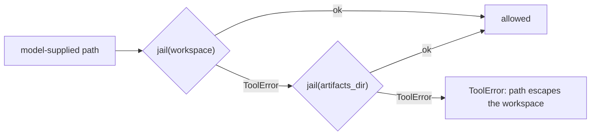

# The path jail

`executors/tools.py: jail()` is the single choke point that decides whether a model-supplied path may
be touched at all. Every filesystem tool goes through it. `LocalShellRuntime` imports the same
function, so there is exactly one containment definition in the codebase.

## `jail(root, candidate) -> Path`

Rejects (never clamps, never repairs):

- a non-string, an empty string, a NUL byte, or more than `MAX_PATH_LEN` (4096) characters;
- an absolute or relative path that resolves outside `root`;
- for a target that does not exist yet, a nearest EXISTING ancestor that resolves outside `root` —
  so a symlinked parent directory cannot be used to redirect a write.

Resolution is `Path.resolve(strict=False)` plus `is_relative_to`, so `../`, absolute escapes and
symlinks pointing outside are all caught. The error message never reveals the absolute root:
`path escapes the workspace: '<candidate>'`.

`jail()` takes ONE root per call, deliberately — the containment check stays single-purpose and
auditable.

## `_jailed(ctx, candidate)` — the two permitted roots

The **workspace** (the repo checkout a step edits) is tried FIRST, so a relative path always means
"in the repo" and nothing that used to land in the repo now lands in the run dir instead. Only a path
that is not under the workspace at all gets a second chance against **`ctx.artifacts_dir`**
(`runs/<id>/`). When both refuse, the WORKSPACE error is what propagates.

Both roots are orchestrator-owned. Nothing else becomes reachable.

## Why the run dir has to be writable — the defect

A workspace-only jail refused every artifact the shipped role prompts ask for:

- `prompts/roles/planner.md` writes `{plan_file}` and `{sections_dir}/section-N.md`;
- `prompts/roles/coder.md` reads `{section_file}` back;
- `prompts/roles/reporter.md` writes `{run_dir}/pr.md` and `{run_dir}/ticket_comment.md`.

`engine/context.py` renders all of those as ABSOLUTE run-dir paths. Under the `api` executor — the
default for the offline profiles — every one of those calls came back
`path escapes the workspace: '<run_dir>/plan.md'`. The plan step then wrote nothing, the `for_each`
fan-out found no sections, and the run failed with *"the planner produced no sections"*.
`ExecRequest.artifacts_dir` was documented as "where the step may drop files (run dir)" and threaded
all the way into `ToolContext.artifacts_dir` — where no filesystem tool ever consulted it.

The offline end-to-end test missed it because `FakeExecutor` wrote its run-dir artifacts with
`Path.write_text` directly, never through the jail. See [../testing/summary.md](../testing/summary.md).

## Admitting the run dir does not admit the run RECORD

`_reject_reserved_artifact(ctx, path, label)` runs on every `fs.write`/`fs.edit` whose resolved path
lands inside `ctx.artifacts_dir`, and refuses:

| Reserved | Why |
|---|---|
| `run.json`, `run.json.tmp` | the resumable state `RunStore.load()` trusts |
| `config.resolved.yaml` | which (redacted) profile the run actually used |
| `workitem.json` | the ticket as fetched, before any step ran |
| `banner.txt` | the "what was used" record printed at start |
| `logs/**` | the per-step tool/stdout trace — `append_log` only ever APPENDS, so one truncating write erases what the step just did |

Without it, any step holding `fs.write` could rewrite its own audit trail: ticket text steering the
`implement` step to blank `{run_dir}/logs/implement.log` after acting leaves a run that still reports
OK with no record of the tool calls it made.

`plan.md`, `sections/`, `steps/`, `pr.md` and `ticket_comment.md` stay writable — they ARE the
deliverables. A `run.json` inside the WORKSPACE is an ordinary source file and is untouched by this;
the check is keyed on the path resolving under the artifacts dir, not on the name alone.

Still open: `pr.md`/`ticket_comment.md` are writable by any step, not only the reporter, so an
injected earlier step can pre-decide what gets posted to the ticket. The outbound `redact()` in
[../config/secrets-and-redaction.md](../config/secrets-and-redaction.md) covers the credential half
of that; restricting a run-dir path by step role is not implemented.

## The other half of the rule

Admitting the run dir does NOT mean run-dir writes count as workspace edits. `ApiLoopExecutor._finish`
filters `files_written` back down to workspace-relative paths, because that list feeds
`repo.verify_landed()`. Both halves are needed; either one alone fails a run.
See [summary.md](summary.md).

## Related guards elsewhere

- `RunStore._jailed_relpath` — artifact paths must be relative and free of `..`.
- `FileSink._safe_filename` and `JiraSource.download_attachment` — an attacker-controlled attachment
  filename is reduced to its basename and the resolved destination re-checked.
- `config/loader.resolve_ref` — a `builtin:` ref may not contain `..` or escape the builtin root.
- `GitLocalRepo._sanitize_branch` — an untrusted ticket title can never become something that looks
  like a git/gh flag.
